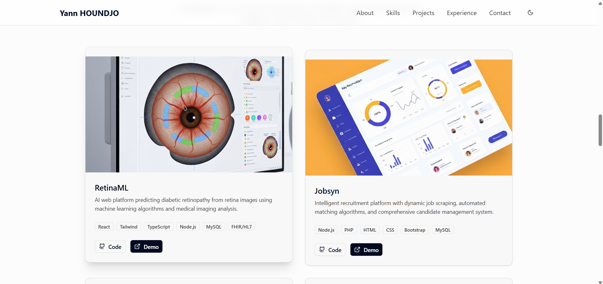
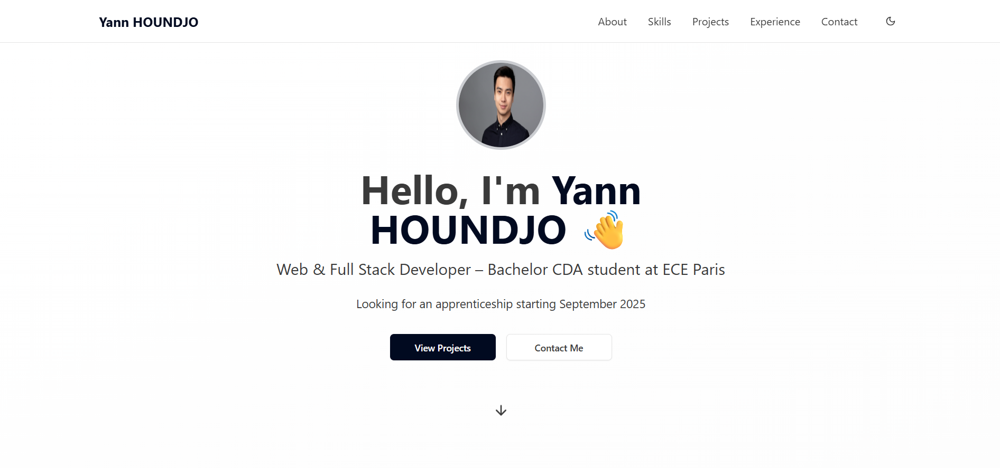

# 🌐 Portfolio – Yann HOUNDJO

Bienvenue sur mon portfolio personnel !  
Je suis **Yann Marie-Gilles HOUNDJO**, étudiant en **Bachelor Concepteur Développeur d’Applications (CDA)** à l’**ECE Paris**, passionné par le **développement web & full stack**.  
À travers ce site, je partage mes projets, mes expériences et mes compétences.

---

## 🚀 Aperçu en ligne

🔗 **Lien en ligne (Vercel)** : [https://portfolio-yann.vercel.app]  

📸 **Capture d’écran** :  
# 🌐 Portfolio – Yann HOUNDJO

Bienvenue sur mon portfolio personnel !  
Je suis **Yann Marie-Gilles HOUNDJO**, étudiant en **Bachelor Concepteur Développeur d’Applications (CDA)** à l’**ECE Paris**, passionné par le **développement web & full stack**.  
À travers ce site, je partage mes projets, mes expériences et mes compétences.

---

## 🚀 Aperçu en ligne

🔗 **Lien en ligne (Vercel)** : [https://portfolio-yann.vercel.app](https://portfolio-yann.vercel.app) *(sera actif après déploiement)*  

📸 **Capture d’écran** :  
# 🌐 Portfolio – Yann HOUNDJO

Bienvenue sur mon portfolio personnel !  
Je suis **Yann Marie-Gilles HOUNDJO**, étudiant en **Bachelor Concepteur Développeur d’Applications (CDA)** à l’**ECE Paris**, passionné par le **développement web & full stack**.  
À travers ce site, je partage mes projets, mes expériences et mes compétences.

---

## 🚀 Aperçu en ligne

🔗 **Lien en ligne (Vercel)** : [https://portfolio-yann.vercel.app](https://portfolio-yann.vercel.app) *(sera actif après déploiement)*  

📸 **Capture d’écran** :  




---

## 🛠️ Stack technique

- **Frontend** : [React.js](https://react.dev/) + [Next.js](https://nextjs.org/)  
- **UI & Design** : [Tailwind CSS](https://tailwindcss.com/), [shadcn/ui](https://ui.shadcn.com/)  
- **Animations** : [Framer Motion](https://www.framer.com/motion/)  
- **Déploiement** : [Vercel](https://vercel.com)  

---

## 📂 Sections du Portfolio

- 🏠 **Accueil / Hero** : Présentation rapide + CTA (Projets / Contact)  
- 👨‍💻 **À propos** : Parcours et compétences  
- ⚡ **Compétences** : Frontend, Backend, Bases de données, Outils, Data/IA  
- 📚 **Projets** : Showcase de projets principaux (RetinaML, Jobsyn, Pacman, TGV Project)  
- 💼 **Expériences** : Timeline de mes stages & expériences pro  
- ✉️ **Contact** : Formulaire d’envoi d’email + liens LinkedIn & GitHub  

---

## 🔗 Liens utiles

- 📧 Email : [yannmgh@gmail.com](mailto:yannmgh@gmail.com)  
- 💼 LinkedIn : [Yann Marie-Gilles HOUNDJO](https://www.linkedin.com/in/yann-marie-gilles-houndjo-422001316/)  
- 💻 GitHub : [@Yannmgh](https://github.com/Yannmgh)  

---

## ⚡ Installation locale

Si vous souhaitez exécuter le projet en local :  

```bash
# Cloner le repo
git clone https://github.com/Yannmgh/portfolio-yann.git
cd portfolio-yann

# Installer les dépendances
npm install

# Lancer le serveur de dev
npm run dev


---

## 🛠️ Stack technique

- **Frontend** : [React.js](https://react.dev/) + [Next.js](https://nextjs.org/)  
- **UI & Design** : [Tailwind CSS](https://tailwindcss.com/), [shadcn/ui](https://ui.shadcn.com/)  
- **Animations** : [Framer Motion](https://www.framer.com/motion/)  
- **Déploiement** : [Vercel](https://vercel.com)  

---

## 📂 Sections du Portfolio

- 🏠 **Accueil / Hero** : Présentation rapide + CTA (Projets / Contact)  
- 👨‍💻 **À propos** : Parcours et compétences  
- ⚡ **Compétences** : Frontend, Backend, Bases de données, Outils, Data/IA  
- 📚 **Projets** : Showcase de projets principaux (RetinaML, Jobsyn, Pacman, TGV Project)  
- 💼 **Expériences** : Timeline de mes stages & expériences pro  
- ✉️ **Contact** : Formulaire d’envoi d’email + liens LinkedIn & GitHub  

---

## 🔗 Liens utiles

- 📧 Email : [yannmgh@gmail.com](mailto:yannmgh@gmail.com)  
- 💼 LinkedIn : [Yann Marie-Gilles HOUNDJO](https://www.linkedin.com/in/yann-marie-gilles-houndjo-422001316/)  
- 💻 GitHub : [@Yannmgh](https://github.com/Yannmgh)  

---

## ⚡ Installation locale

Si vous souhaitez exécuter le projet en local :  

```bash
# Cloner le repo
git clone https://github.com/Yannmgh/portfolio-yann.git
cd portfolio-yann

# Installer les dépendances
npm install

# Lancer le serveur de dev
npm run dev


---

## 🛠️ Stack technique

- **Frontend** : [React.js](https://react.dev/) + [Next.js](https://nextjs.org/)  
- **UI & Design** : [Tailwind CSS](https://tailwindcss.com/), [shadcn/ui](https://ui.shadcn.com/)  
- **Animations** : [Framer Motion](https://www.framer.com/motion/)  
- **Déploiement** : [Vercel](https://vercel.com)  

---

## 📂 Sections du Portfolio

- 🏠 **Accueil / Hero** : Présentation rapide + CTA (Projets / Contact)  
- 👨‍💻 **À propos** : Parcours et compétences  
- ⚡ **Compétences** : Frontend, Backend, Bases de données, Outils, Data/IA  
- 📚 **Projets** : Showcase de projets principaux (RetinaML, Jobsyn, Pacman, TGV Project)  
- 💼 **Expériences** : Timeline de mes stages & expériences pro  
- ✉️ **Contact** : Formulaire d’envoi d’email + liens LinkedIn & GitHub  

---

## 🔗 Liens utiles

- 📧 Email : [yannmgh@gmail.com](mailto:yannmgh@gmail.com)  
- 💼 LinkedIn : [Yann Marie-Gilles HOUNDJO](https://www.linkedin.com/in/yann-marie-gilles-houndjo-422001316/)  
- 💻 GitHub : [@Yannmgh](https://github.com/Yannmgh)  

---

## ⚡ Installation locale

Si vous souhaitez exécuter le projet en local :  

```bash
# Cloner le repo
git clone https://github.com/Yannmgh/portfolio-yann.git
cd portfolio-yann

# Installer les dépendances
npm install

# Lancer le serveur de dev
npm run dev
